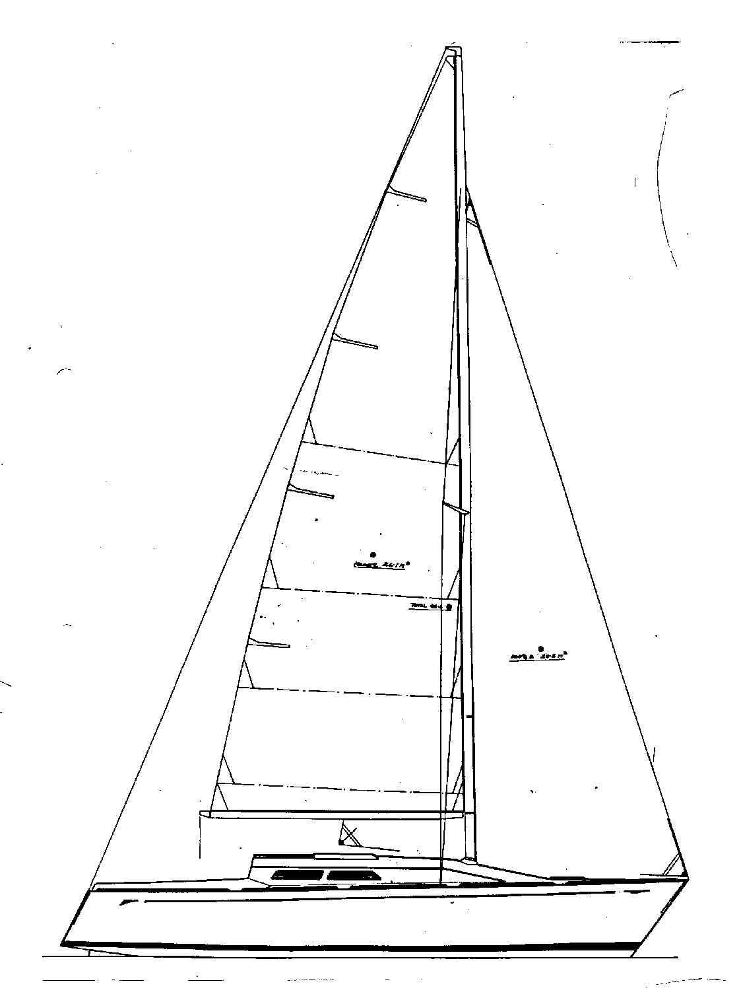

# About

 

SY Spectrum was built in 1988 in Cape Town, a Lavranos L34 racer-cruiser.

| | |
| -- | -- |
| Model | L34 |
| Designer | Angelo Lavranos |
|Builder| John Robertson Yachts|
| LOA | 34' |
|LWL |  8.23 m |
|Beam |  3.31 m |
|Keel |  Fin with bulb |
| Launched | 1988 |

SY Spectrum sailed from South African to Cape Horn, Antarctica, the Chilean Channels and across the Pacific Ocean, finally reached Taiwan.

SY Spectrum is attuning to fields of majesty.

Current owner is the 5th owner of SY Spectrum. Here is the boat keeper's humble log while listening and tunning.

                                
              
    
