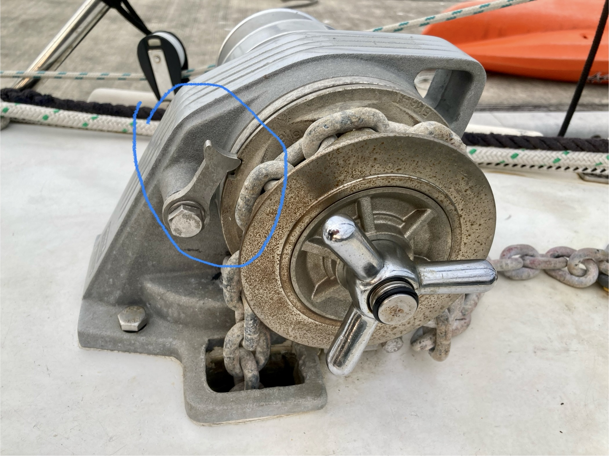

# Lofrans Kobra Windlass

[User's Manual ](lofrans-windlass/Installation And User's Manual ~ Dorado - Kobra.pdf)

## trouble shooting 

* If the clutch nut can not be loosen by turning counter-clock-wise with the handle

    Lock the gypsy and try again. Turn the clutch nut counter-clock-wise with the handle.

    
