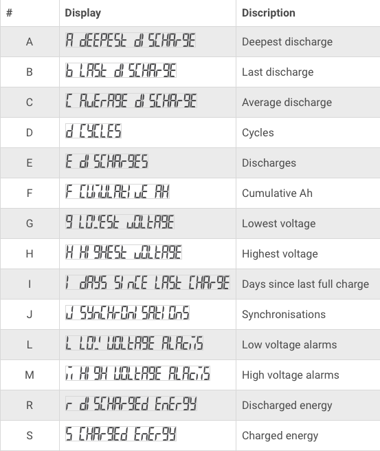

# victron energy BMV-700 Battery Monitor

[product page](https://www.victronenergy.com/display-and-panels/bmv-700)

## Accessing historical data via the head unit

> To view the battery monitor history menu press SELECT when in normal mode:

> Press + or – to browse the various parameters.

> Press + or – to browse the various values.

> Press SELECT again to stop scrolling and show the value.

> Press SELECT again to leave the historical menu and to go back to the normal operation mode.

> The below table gives an overview of the history parameters and how they are displayed in the menu. For the meaning of each parameter see the next chapter.

## Logs

| | 2025/02/21 |
| -- | -- |
| Deepest discharge | |
|Last discharge | |
|Average discharge | |
|Cycles | |
|Discharges | |
|Cumulative Ah | |
|Lowest voltage | |
|Highest voltage | |
|Days since last full charge | |
|Synchronisations | |
|Low voltage alarms | |
|High voltage alarms | |
|Discharged energy | |
|Charged energy | |

[mkdocs-charts-plugin](https://github.com/timvink/mkdocs-charts-plugin)

