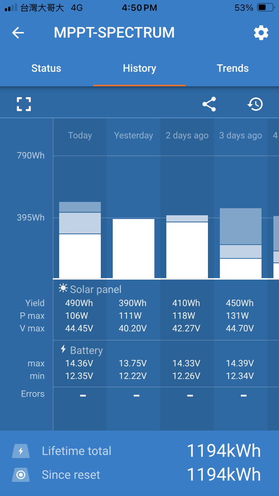
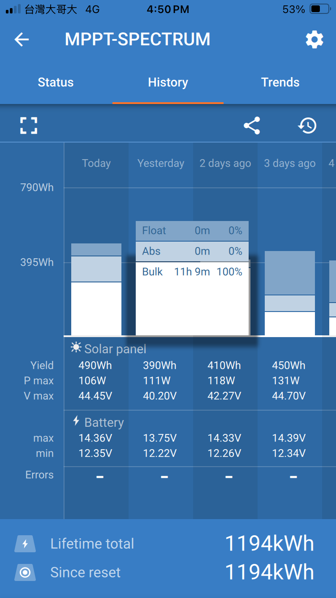

# victron energy SmartSolar charge controllers MPPT 100/30

[product page](https://www.victronenergy.com/solar-charge-controllers/mppt-100-30)

[MPPT solar charger manual](https://www.victronenergy.com/media/pg/Manual_SmartSolar_MPPT_100-30__100-50/en/index-en.html)

## VoctronConnect App

See the charging history in the app. Even in the cloudy and rainy days, the overall output power per day is still around 395Wh. The difference in charging history is that charging phase still in Bulk which means the batteries's voltage is not reaching the desired level yet.

{width=50%}

{width=50%}

