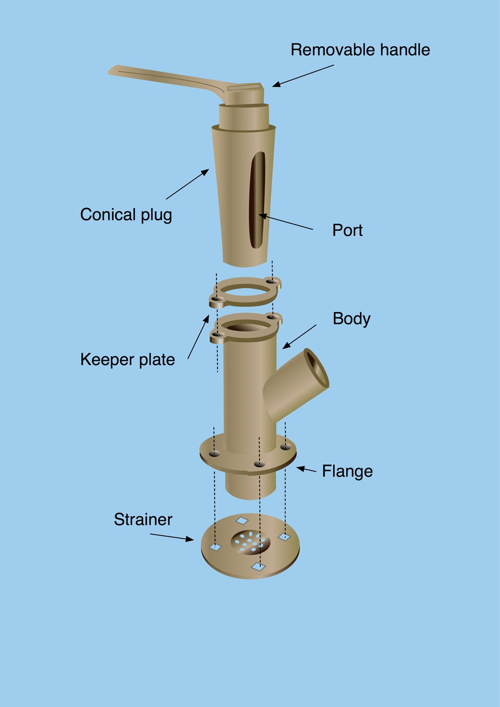
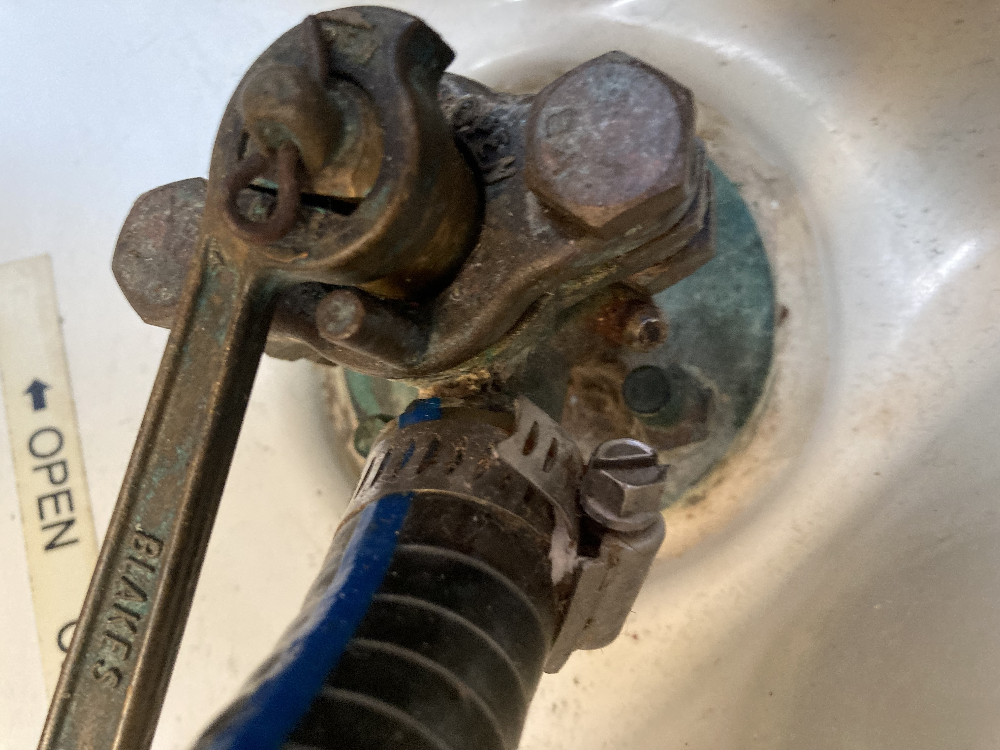
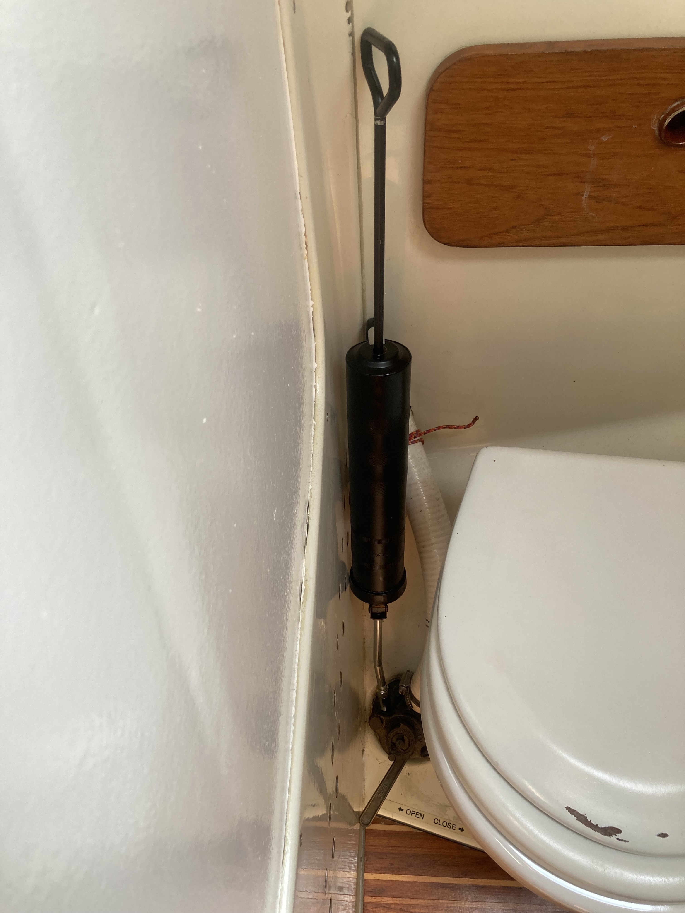
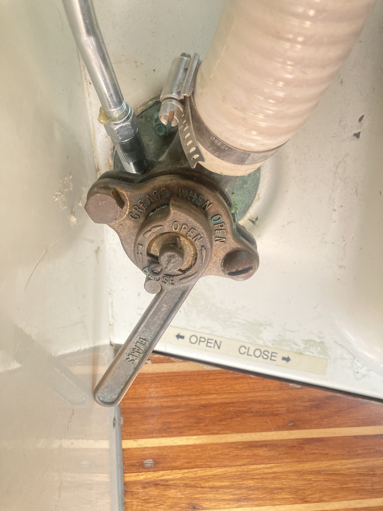

# Seacock

## Cone valve

[reference](https://www.safe-skipper.com/seacock-maintenance/)

## Blakes Seacock 1 1/2" (38mm)

## Blakes Seacock 3/4" (19mm)

## Gease Nipple

* Open to gease

* Use wire to check the the nipple is not blocked. If the handle is closed and you inserted the wire into the nipple, a small stream of water may come out of the nipple, in case of this happens, just turn the handle to open, then the stream will be stopped.

* After geasing, rotate the gease pipe will make it easier to come off.

{width=50%}

{width=50%}

{width=50%}
