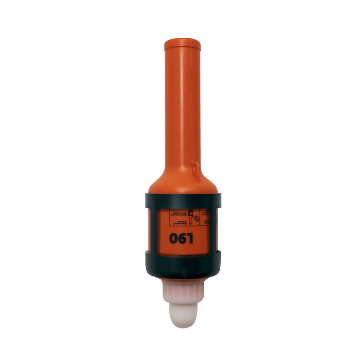

# Daniamant L90 Lifebuoy Light

[product page](https://daniamant.com/products/lifebuoy-lights/l90/)

[Installation and Maintenance Instructions](lifebuoy-light/L90-Lifebuoy-Light-Installation-and-Maintenance-Instructions-English.pdf)

> Install lifebuoy light into bracket with the light in an inverted position.

> Tie the lanyard to the lifebuoy.

> In case of an emergency (man overboard) throw the light overboard together with the lifebuoy.
>
> The light will only function when upright.
>
> When replacing batteries, always use one of the following brands:-

> – Duracell®PlusPower/DuracellCoppertop

> – IndustrialbyDuracell®

> – Duracell®UltraPower/DuracellUltraAdvanced – Panasonic®XtremePower

> – Varta®

