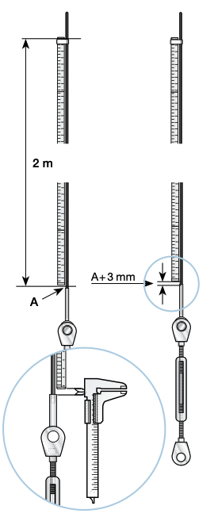

# Folding Rule Method

## Selden 

[Hints and advice](https://support.seldenmast.com/files/1605537330/595-540-E.pdf)

* All 1 x 19 stainless wire stretches under load, but returns to its original length when the load is removed. 1 mm stretch per 2 m wire is equivalent to 5% of the breaking load, irrespective of the diameter of the wire.

* Tension the cap shrouds to 15-20% of the breaking load.

